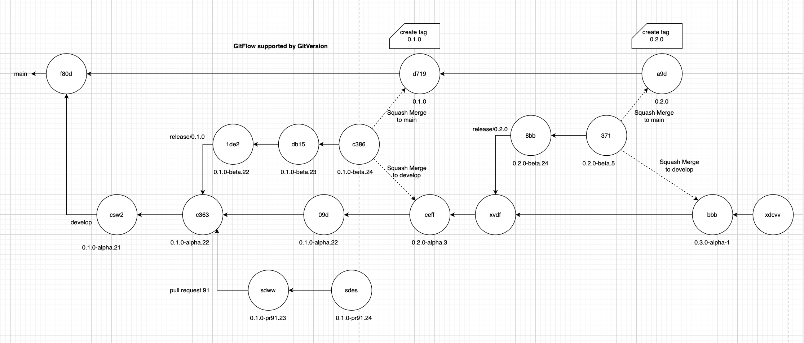

# README

## GitHub Workflows

This repository contains automated workflows located in the `.github/workflows` directory. Below is an overview of the workflows:

### Workflows Overview

1. autio-versioning.yaml

- This workflow is used to test the versioing process. It is disabled by default and only enabled when needed.

2. build-template.yaml

- This is templat workflow called my main work flow to build Zeva2 images on Openshift.

3. cron-cleanup-workflow-runs.yaml

- This a workflow used to cleanup the workflow runs according to the settings inside.

4. deploy-template.yaml

- This workflow is a template workflow used deploy Zeva2 images to teh target environment.

5. dev-ci.yaml

- This is the development pipeline to build and deploy Zeva2 applications to dev environment.
- Every commit on the develop branch will trigger this pipeline.

6. hotfix-ci.yaml

- This pipeline is used to build and deploy hotfixs to prod environment.
- Every commit on the hotfix branch will trigger this pipeline.

7. pr-build.yaml

- This is the pull request build and deployment pipeline.
- Every pull request labeled with build targeting on develop or release/\* will trigger this pipeline

8. pr-teardown.yaml

- This pipeline will tear down the pull request build on dev environment
- Remove the build lable on any pull request targeting on develop or release/\* will trigger this pipeline

9. prod-ci.yaml

- This is the prod pipeline to build and deploy Zeva2 applications to prod environment
- The commits on main branch will trigger this pipeline

10. test-ci.yaml

- This is the test pipeline to build and deploy Zeva2 applications to test environment
- The commits on release/\* branches will trigger this pipeline

## GitFlow Branching Model

Zeva2 brancing model fully complies with GitFLow. GitVersion is adopted to support the automatical versioning

