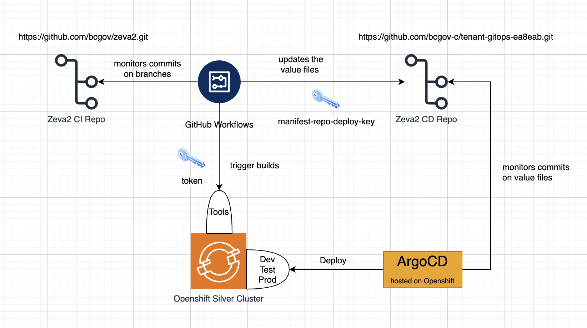
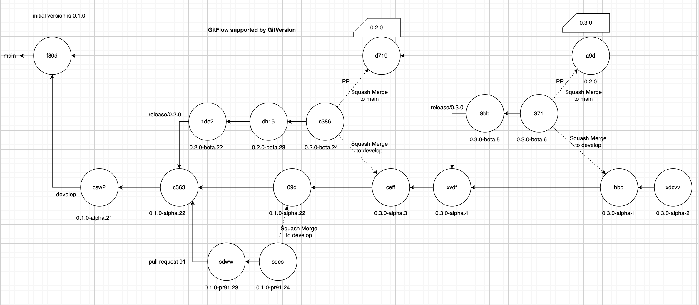
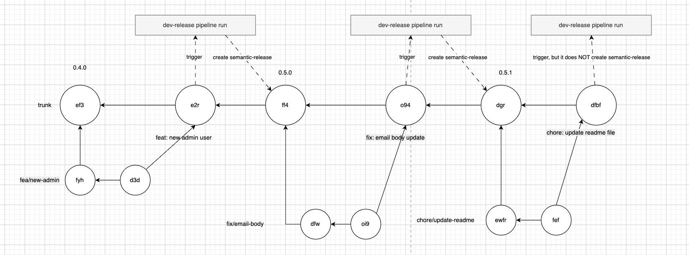

# Zeva2 Branching Model

## Git Branching Strategy

Zeva2 adopted the [Gitflow](https://www.atlassian.com/git/tutorials/comparing-workflows/gitflow-workflow) as strategy for managing Git branches

## Git Versioning Tool

Zeva2 adopted [GitVersion](https://gitversion.net/docs/reference/configuration) as the versioning tool as it fully supports Gitglow branching strategy.

# Zeva2 Pipelines

This repository contains automated workflows located in the `.github/workflows` directory. Below is an overview of the workflows:

## Workflows Overview

**1. autio-versioning.yaml**

- This workflow is used to test the versioing process. It is disabled by default and only enabled when needed.

**2. build-template.yaml**

- This is templat workflow called my main work flow to build Zeva2 images on Openshift.

**3. cron-cleanup-workflow-runs.yaml**

- This a workflow used to cleanup the workflow runs according to the settings inside.

**4. deploy-template.yaml**

- This workflow is a template workflow used deploy Zeva2 images to teh target environment.

**5. dev-ci.yaml**

- This is the development pipeline to build and deploy Zeva2 applications to dev environment.
- Every commit on the develop branch will trigger this pipeline.

**6. hotfix-ci.yaml**

- This pipeline is used to build and deploy hotfixs to prod environment.
- Every commit on the hotfix branch will trigger this pipeline.

**7. pr-build.yaml**

- This is the pull request build and deployment pipeline.
- Every pull request labeled with build targeting on develop or release/\* will trigger this pipeline

**8. pr-teardown.yaml**

- This pipeline will tear down the pull request build on dev environment
- Remove the build lable on any pull request targeting on develop or release/\* will trigger this pipeline

**9. prod-ci.yaml**

- This is the prod pipeline to build and deploy Zeva2 applications to prod environment
- The commits on main branch will trigger this pipeline

**10. test-ci.yaml**

- This is the test pipeline to build and deploy Zeva2 applications to test environment
- The commits on release/\* branches will trigger this pipeline

# GitFlow Branching Strategy demo

## Zeva2 Continuous Delivery Diagram

## Zeva2 Branching Model

Zeva2 versioning is fully automatic and only updates major and minor versions. Branch naming converion is:

- develop
- main
- release/\*
- hotfix/\*

# Zeva2 Trunk Based Development Model

## What is the trunck based development model

Learn why this version control management practice is common practice among DevOps teams. https://www.atlassian.com/continuous-delivery/continuous-integration/trunk-based-development

## Semantic Release

Fully automated version management and package publishing https://github.com/semantic-release/semantic-release

## Conventional Commit

Simple conventional commit messages:

- feat: add export button → Yes (minor release)
- fix: handle null user → Yes (patch release)
- perf: optimize search query → Yes (patch release)
- chore: update dependencies → No
- docs: update README → No
- refactor: simplify auth middleware → No
- test: add user service tests → No
- ci: adjust release workflow → No
- build: bump Node version → No
- style: format lint rules → No

With scopes:

- feat(api): add pagination → Yes (minor release)
- fix(ui): prevent double submit → Yes (minor release)
- chore(ci): update GitHub actions → No
- docs(README): add setup guide → No

Breaking changes:

- feat! : remove legacy endpoint → Yes (major release)
- refactor(auth)! : change token format → Yes (major release)
- feat: remove legacy endpoint + BREAKING CHANGE: ... → Yes (major release)

Semantic release commit message (auto generated by semantic release):

- chore(release): 1.2.3 [skip ci] → No (it’s the release commit itself, and [skip ci] prevents CI)

## Husky

A npm package to enforce the conventional commit

## Feature Flag

Use feature flags to disable the unmatured feature on prod release

# Zeva2 Pipelines

## release-dev.yaml

Every commit to main triggers this pipeline. It does the following:

- run the jest test suit
- based on the conventional commit history, the semantic release process decides if needs to create a release
- if there is a new release created, build the images on Openshift Tools namespace
- deploy the images on Openshift Dev environment.

## promote-test.yaml

Manually triggered pipelin to deploy the images to Openshift Test

- provide the image version to be deployed
- create the pull request with the version changed in CD Repo
- once the pull request is approved, the version will be deployed on Oepnshift Test environment

## release-prod.yaml

Manually triggered pipelin to deploy the images to Openshift Prod. Same logic as the test deployment.
