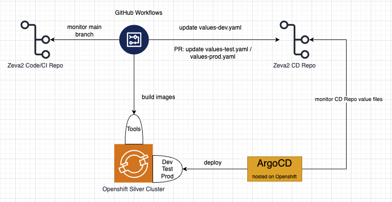
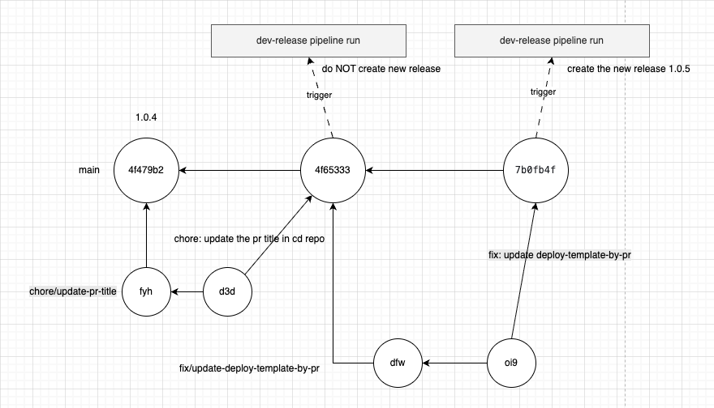
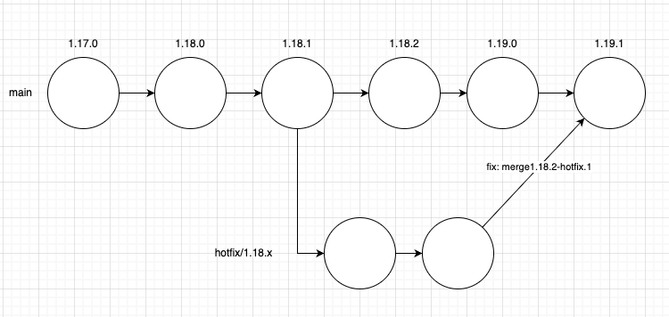

# 1. CI/CD

CI/CD (Continuous Integration and Continuous Delivery/Deployment) automates building, testing, and releasing software.

[What is CI/CD] (https://www.geeksforgeeks.org/devops/what-is-ci-cd)

Zeva2 CI/CD Diagram:

- Zeva2 code/CI repository: https://github.com/bcgov/zeva2.git
- Zeva2 CD repository: https://github.com/bcgov-c/tenant-gitops-ea8eab.git
- GitHub Workflows monitor code repository changes and update deployment configuration in the CD repository.
- ArgoCD monitors CD repository changes and applies deployments to OpenShift.

# 2. Trunk Based Development

Trunk-based development is a branching model where developers integrate frequently into a single primary branch (`main`).
It minimizes long-lived branches, reduces merge conflicts, and keeps releases flowing from a stable trunk.

- [Trunk Based Development Introduction](https://trunkbaseddevelopment.com)
- [Trunk Based Development vs Git Flow](https://www.geeksforgeeks.org/devops/trunk-based-development-in-software-development/)

This section summarizes the Zeva2 approach, where short-lived branches merge frequently into `main` and releases are cut from trunk.
A sample diagram illustrates this model:

Principles of trunk-based development:

- Keep changes small and incremental.
- Create short-lived branches from `main`.
- Avoid long-lived branches other than `main`.
- Review and merge PRs quickly (ideally within a day).
- Use feature flags to ship safely and control rollout.
- Require Conventional Commit messages.
- Require a passing test suite as a mandatory PR status check.

## 2.1 Semantic Release

Semantic Release analyzes commit messages to determine the next version, generates release notes, and
publishes a GitHub Release automatically. It helps keep versioning consistent and reduces manual work.

https://github.com/semantic-release/semantic-release

## 2.2 Conventional Commit

Conventional Commits provide a structured message format that semantic-release can parse to determine
version bumps. They also make commit history easier to understand and automate.

Simple conventional commit messages:

- feat: add export button → Yes (minor release)
- fix: handle null user → Yes (patch release)
- perf: optimize search query → Yes (patch release)
- chore: update dependencies → No
- docs: update README → No
- refactor: simplify auth middleware → No
- test: add user service tests → No
- ci: adjust release workflow → No
- build: bump Node version → No
- style: format lint rules → No

With scopes:

- feat(api): add pagination → Yes (minor release)
- fix(ui): prevent double submit → Yes (patch release)
- chore(ci): update GitHub actions → No
- docs(README): add setup guide → No

Breaking changes:

- feat! : remove legacy endpoint → Yes (major release)
- refactor(auth)! : change token format → Yes (major release)
- feat: remove legacy endpoint + BREAKING CHANGE: ... → Yes (major release)

Semantic-release commit message (auto generated by semantic-release):

- chore(release): 1.2.3 [skip ci] → No (it’s the release commit itself, and [skip ci] prevents CI)

## 2.3 Husky

Husky runs Git hooks locally to enforce commit standards (such as Conventional Commits) before code is
committed. This helps keep commit history clean and compatible with semantic-release.

# 3. Promote Release to Test

Use this process to promote a validated Dev release to Test.

1. Confirm the target version is already deployed to Dev and has passed validation.
2. Manually run the workflow **Promote to Test (RC Release)**.
3. Enter the version to promote.
4. Review the PR created in the CD repository:
   - Verify the PR description and target version.
   - Confirm the target version is newer than the currently deployed Test version.
   - If the PR indicates a backward deployment, confirm with Developers/DevOps before merging.
5. Approve and merge the PR.
6. After merge, ArgoCD deploys the new version to Test automatically.

# 4. Hotfix Release to Test

Use this process for emergency fixes on Test without pulling unrelated changes from `main`.

Example: Test is currently on `1.1.0` and a production issue requires an urgent fix.

1. Create a hotfix branch from the deployed Test tag:
   - `git checkout -b hotfix/1.1.0 v1.1.0`
   - `git push -u origin hotfix/1.1.0`
2. Add only the emergency fix changes on that branch and commit with Conventional Commits (for example: `fix: ...`).
3. Manually run **Hotfix to Test (Emergency Release)** using branch `hotfix/1.1.0`.
4. Verify the generated hotfix version (for example: `1.1.1-hotfix.1`, then `.2`, `.3` for additional hotfix commits).
5. Review and merge the Test deployment PR created in the CD repository.
6. Review and merge the auto-created PR from the hotfix branch back to `main` to keep trunk aligned.

# 5. Caller Workflows

- [release-dev.yaml](../workflows/dev-release.yml)
- [promote-test.yaml](../workflows/promote-test.yml)
- [release-prod.yaml](../workflows/release-prod.yml)
- [pr-test.yaml](../workflows/pr-test.yaml)
- [pr-title-lint.yml](../workflows/pr-title-lint.yml)
- [pr-build.yaml](../workflows/pr-build.yaml)
- [pr-teardown.yaml](../workflows/pr-teardown.yaml)
- [cron-cleanup-workflow-runs.yaml](../workflows/cron-cleanup-workflow-runs.yaml)
- [hotfix-test.yaml](../workflows/hotfix-test.yml)
- [pr-commit-lint.yaml](../workflows/pr-commit-lint.yaml)

# 6. Reuseable Workflows

- [install-oc-template.yaml](../workflows/install-oc-template.yaml)
- [build-template.yaml](../workflows/build-template.yaml)
- [deploy-template.yaml](../workflows/deploy-template.yaml)
- [deploy-template-by-pr.yaml](../workflows/deploy-template-by-pr.yaml)
