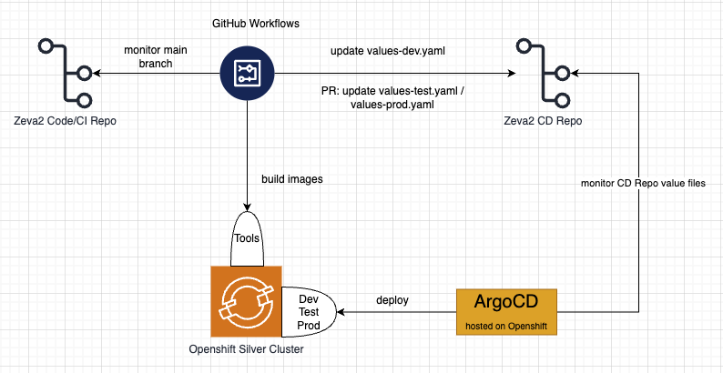
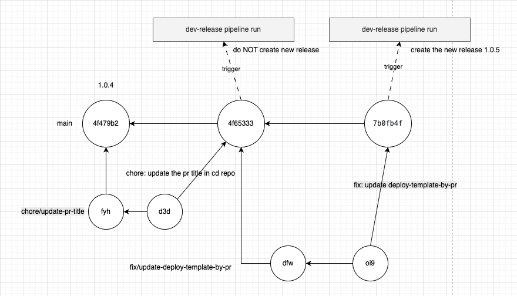
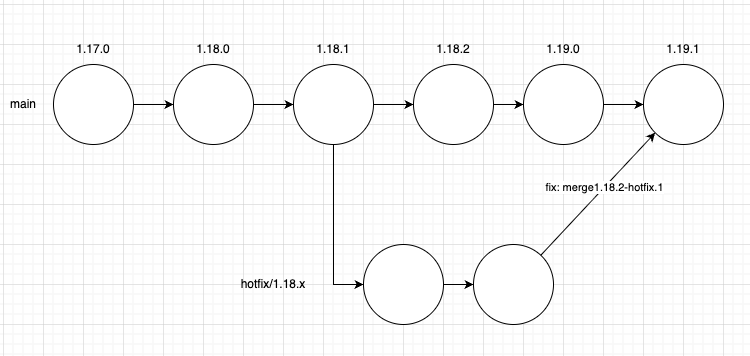

# 1. CI/CD

CI/CD (Continuous Integration and Continuous Delivery/Deployment) automates building, testing, and releasing software.

[What is CI/CD] (https://www.geeksforgeeks.org/devops/what-is-ci-cd)

Zeva2 CI/CD Diagram:

- Zeva2 code/CI repository: https://github.com/bcgov/zeva2.git
- Zeva2 CD repository: https://github.com/bcgov-c/tenant-gitops-ea8eab.git
- GitHub Workflows monitor code repository changes and update deployment configuration in the CD repository.
- ArgoCD monitors CD repository changes and applies deployments to OpenShift.

# 2. Trunk Based Development

Trunk-based development is a branching model where developers integrate frequently into a single primary branch (`main`).
It minimizes long-lived branches, reduces merge conflicts, and keeps releases flowing from a stable trunk.

- [Trunk Based Development Introduction](https://trunkbaseddevelopment.com)
- [Trunk Based Development vs Git Flow](https://www.geeksforgeeks.org/devops/trunk-based-development-in-software-development/)

This section summarizes the Zeva2 approach, where short-lived branches merge frequently into `main` and releases are cut from trunk.
A sample diagram illustrates this model:

## 2.1 Best Practices for Trunk-Based Development

- Keep changes small, focused, and incremental.
- Create short-lived branches from `main` and merge quickly.
- Avoid long-lived parallel development branches.
- Rebase or sync with `main` frequently to reduce merge conflicts.
- Use pull requests with fast review cycles (ideally same day).
- Protect `main` with required checks (tests, lint, commit rules).
- Require Conventional Commits for consistent release automation.
- Keep CI fast and reliable so developers trust the pipeline.
- Use feature flags to separate deploy from release.
- Prefer backward-compatible changes and gradual rollout strategies.
- Automate versioning and release notes with semantic-release.
- Use hotfix branches only for urgent exceptions, then merge back to `main` quickly.
- Keep deployment environments in sync by promoting versions forward.
- Establish a team agreement for Conventional Commits (for example, when to use `feat`, `fix`, and other commit types).

## 2.2 Semantic Release

Semantic Release analyzes commit messages to determine the next version, generates release notes, and
publishes a GitHub Release automatically. It helps keep versioning consistent and reduces manual work.

https://github.com/semantic-release/semantic-release

## 2.3 Conventional Commit

Conventional Commits provide a structured message format that semantic-release can parse to determine
version bumps. They also make commit history easier to understand and automate.

Simple conventional commit messages:

- feat: add export button → Yes (minor release)
- fix: handle null user → Yes (patch release)
- perf: optimize search query → Yes (patch release)
- chore: update dependencies → No
- docs: update README → No
- refactor: simplify auth middleware → No
- test: add user service tests → No
- ci: adjust release workflow → No
- build: bump Node version → No
- style: format lint rules → No

With scopes:

- feat(api): add pagination → Yes (minor release)
- fix(ui): prevent double submit → Yes (patch release)
- chore(ci): update GitHub actions → No
- docs(README): add setup guide → No

Breaking changes:

- feat! : remove legacy endpoint → Yes (major release)
- refactor(auth)! : change token format → Yes (major release)
- feat: remove legacy endpoint + BREAKING CHANGE: ... → Yes (major release)

Semantic-release commit message (auto generated by semantic-release):

- chore(release): 1.2.3 [skip ci] → No (it’s the release commit itself, and [skip ci] prevents CI)

## 2.4 Husky

Husky runs Git hooks locally to enforce commit standards (such as Conventional Commits) before code is
committed. This helps keep commit history clean and compatible with semantic-release.

# 3. Promote a Release to the Test Environment

This procedure assumes basic familiarity with **OpenShift** and **GitHub Actions**.

## Best Practices

Please follow these guidelines when promoting releases:

- **Promote releases frequently** — this could mean multiple releases in a single day or several releases within a sprint.
- **Any release validated in the Dev environment** is eligible for promotion to Test.
- **Minimize the gap** between the versions running in Dev and Test to reduce risk and simplify troubleshooting.

---

## 3.1 Check the Current Release in Test

1.  Navigate to:  
    <https://zeva2-test.apps.silver.devops.gov.bc.ca>
2.  The currently deployed release number is shown at the bottom of the page.

---

## 3.2 Identify the Release to Promote

1.  Go to the GitHub releases page:  
    <https://github.com/bcgov/zeva2/releases>
2.  Compare the candidate release with the version currently running in Test to understand what changes will be promoted.
3.  Check for changes under `next/prisma/migrations`:
    - If changes are present, this indicates one or more database migrations are included in the release.

## 3.3 Start the Test Promotion Workflow

1.  Open **Zeva2 GitHub Actions**.
2.  Run the workflow: **Promote to Test (RC Release)**.
3.  Enter the release number to be promoted.
4.  Start the workflow and monitor it until completion.

## 3.4 Review and Merge the CD Repository Pull Request

1.  Go to the CD repository:  
    <https://github.com/bcgov-c/tenant-gitops-ea8eab>
2.  Locate the newly created pull request.
3.  Verify that the release number is correct.
4.  Merge the pull request.

## 3.5 Verify the Release in the Test Environment

1.  Log in to the OpenShift console:  
    <https://console.apps.silver.devops.gov.bc.ca>
2.  Select the project: **ea8eab-test**.
3.  Monitor the deployments:
    - `zeva2-next-test`
    - `zeva2-bullmq-test`
4.  If database migrations are included:
    - Check the logs for `zeva2-next-test` and confirm there are no migration errors.

## 3.6 Confirm the release is deployed on Test

1.  Navigate to:  
    <https://zeva2-test.apps.silver.devops.gov.bc.ca>
2.  The deployed release number is shown at the bottom of the page, make sure it is the correct release promoted

# 4. Hotfix Release

## Sample Scenario

- There are current releases on the `main` branch:  
  **1.17.0 → 1.18.0 → 1.18.1 → 1.18.2 → 1.19.0**
- The release currently on **Prod** is **1.18.1**
- There is an urgent defect that needs to be fixed on Prod

## Hotfix Process

1. Create a branch `hotfix/1.18.x` from tag `v1.18.1`.

2. The `1.18.x` branch takes care of all hotfixes for versions:  
   **>= 1.18.0 and < 1.19.0**

3. Kick off the **Hotfix to Test** workflow from `hotfix/1.18.x`.  
   Do **not** choose `main`.

4. After the workflow completes, the following artifacts will be created:
   - Release: `1.18.2-hotfix.1`
   - Tag: `1.18.2-hotfix.1`
   - Images:
     - `zeva2-next:1.18.2-hotfix.1`
     - `zeva2-bullmq:1.18.2-hotfix.1`
   - Pull request in **CD repo** pending approval
   - Pull request in **Code repo** to merge the changes in  
     `1.18.2-hotfix.1` into `main`

5. The reason for naming the release `1.18.2-hotfix.1` is that the
   semantic release process treats it as a **pre-release** of `1.18.2`.

   The release history looks like: 1.18.1 → 1.18.2-hotfix.1 → 1.18.2

   Note: `1.18.2` does **not** automatically include the changes from
   `1.18.2-hotfix.1`.

   The changes from the hotfix branch must be merged into `main` with commit message of fix: merge hotfix-1.18.2 to main

   The final release history is 1.17.0 → 1.18.0 → 1.18.1 → 1.18.2 → 1.19.0 → 1.19.1

   Note: when release 1.18.2 or 1.19.0 to test, remember the hotfix won't be there as it is merged in 1.19.1

6. Merge the pull request in the **CD repo**.  
   Once merged, the hotfix will be deployed to **Test**.

# 5. Caller Workflows

- [release-dev.yaml](../workflows/dev-release.yml)
- [promote-test.yaml](../workflows/promote-test.yml)
- [release-prod.yaml](../workflows/release-prod.yml)
- [pr-test.yaml](../workflows/pr-test.yaml)
- [pr-title-lint.yml](../workflows/pr-title-lint.yml)
- [pr-build.yaml](../workflows/pr-build.yaml)
- [pr-teardown.yaml](../workflows/pr-teardown.yaml)
- [cron-cleanup-workflow-runs.yaml](../workflows/cron-cleanup-workflow-runs.yaml)
- [hotfix-test.yaml](../workflows/hotfix-test.yml)
- [pr-commit-lint.yaml](../workflows/pr-commit-lint.yaml)

# 6. Reuseable Workflows

- [install-oc-template.yaml](../workflows/install-oc-template.yaml)
- [build-template.yaml](../workflows/build-template.yaml)
- [deploy-template.yaml](../workflows/deploy-template.yaml)
- [deploy-template-by-pr.yaml](../workflows/deploy-template-by-pr.yaml)
